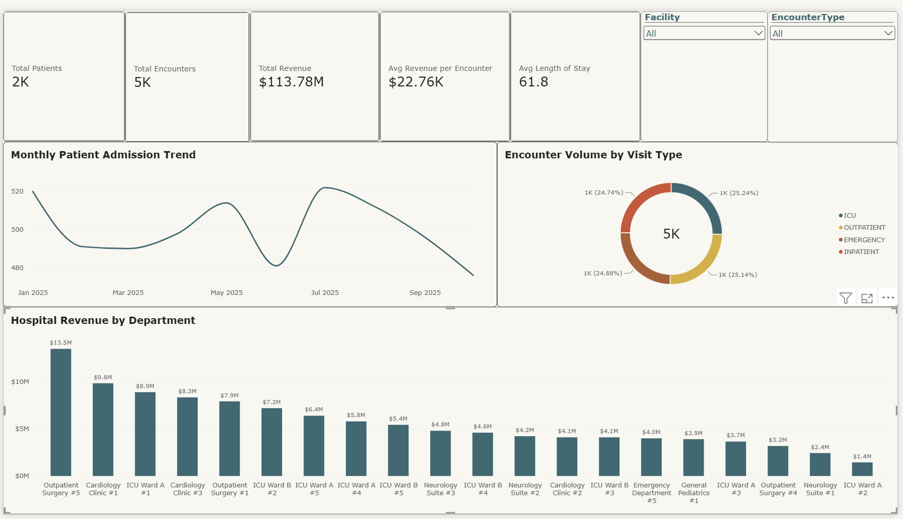
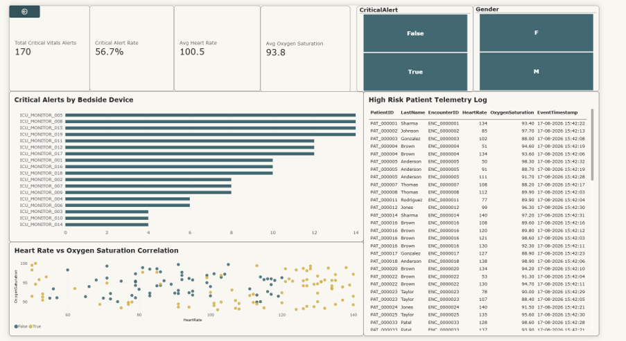
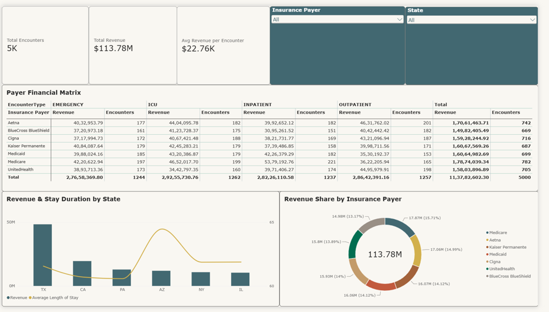

# 📊 ApexCare — Power BI Healthcare Analytics

This folder contains the Power BI analytics layer for the **ApexCare Real-Time Healthcare Data Platform**.

Power BI consumes curated healthcare data from the **Gold layer through Azure Synapse Serverless SQL views**, providing executive, clinical, and financial analytics.

## Analytics Architecture

```text
Azure Data Lake Storage Gen2 — Gold Layer
                    ↓
        Azure Synapse Serverless SQL
                    ↓
              Gold SQL Views
                    ↓
                  Power BI
                    ↓
     Interactive Healthcare Dashboards
```

The reporting layer is organized into three analytical perspectives:

- Executive Healthcare Overview
- Clinical Vitals & Patient Risk Analytics
- Financial & Payer Analytics

---

## 1. Executive Healthcare Overview

Provides a high-level operational view of patient activity, hospital utilization, and revenue performance.

### Key Analytics

- Total Patients
- Total Encounters
- Total Revenue
- Average Revenue per Encounter
- Average Length of Stay
- Monthly Patient Admission Trend
- Encounter Volume by Visit Type
- Hospital Revenue by Department
- Facility and Encounter Type filtering



---

## 2. Clinical Vitals & Patient Risk Analytics

Provides monitoring and analysis of real-time bedside telemetry ingested through the streaming pipeline.

### Key Analytics

- Total Critical Vitals Alerts
- Critical Alert Rate
- Average Heart Rate
- Average Oxygen Saturation
- Critical Alerts by Bedside Device
- Heart Rate vs Oxygen Saturation Analysis
- High-Risk Patient Telemetry
- Patient filtering by alert status and gender

The underlying telemetry originates from the real-time pipeline:

```text
Bedside Telemetry Generator
          ↓
Azure Event Hubs (Kafka)
          ↓
Databricks Structured Streaming
          ↓
Bronze → Silver → Gold
          ↓
Synapse Serverless SQL
          ↓
Power BI
```



---

## 3. Financial & Payer Analytics

Provides financial analysis across insurance payers, encounter types, and geographic regions.

### Key Analytics

- Total Encounters
- Total Revenue
- Average Revenue per Encounter
- Revenue and Encounter Distribution by Insurance Payer
- Revenue & Stay Duration by State
- Revenue Share by Insurance Payer
- Insurance Payer and State filtering



---

## Synapse Serving Layer

Power BI is backed by the **ApexCareGold** database in Azure Synapse Serverless SQL.

The serving layer exposes Gold data through views including:

```text
gold.vw_Dim_Patient
gold.vw_Dim_Provider
gold.vw_Dim_Department
gold.vw_Fact_PatientEncounters
gold.vw_Fact_VitalsTelemetry
gold.vw_exec_encounter_summary
gold.vw_exec_critical_vitals
gold.vw_exec_revenue_by_payer
```

The base views query Parquet files stored in the ADLS Gen2 Gold layer using Synapse Serverless `OPENROWSET`, while the executive views provide aggregated datasets for analytical consumption.

---

## Dashboard Purpose

The Power BI layer demonstrates how the ApexCare platform converts batch and real-time healthcare data into decision-ready analytics for:

**Hospital Executives** → operational and revenue performance  
**Clinical Teams** → patient vitals and critical-alert monitoring  
**Financial Teams** → payer and revenue analysis

> Dashboard screenshots are included for portfolio demonstration. Credentials, connection strings, access keys, and other secrets are intentionally excluded from this repository.